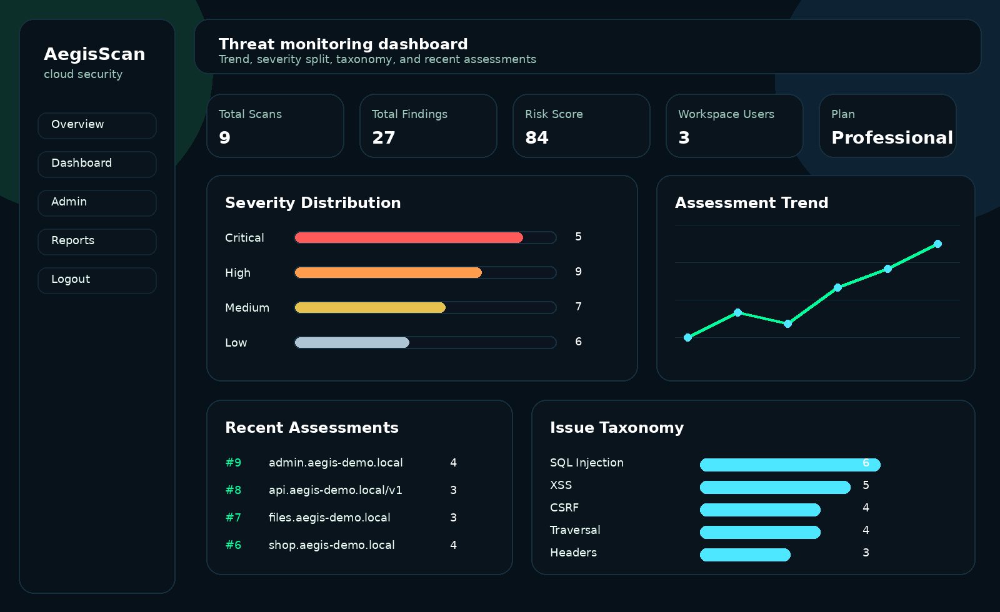

# AegisScan Cloud

AegisScan Cloud is a portfolio-focused security scanner project built with Flask and SQLite. It started as a local vulnerability scanner and was upgraded into a SaaS-style demo platform with workspace-aware auth, plan selection, dashboard analytics, PDF reporting, and an admin surface.

## Why this version is stronger for a CV

- Product-style landing page instead of a plain form
- Workspace/company registration with plan selection
- Role-aware login session and admin route
- Saved scan history and PDF export
- Risk score and severity analytics dashboard
- API key data model for future integrations
- Cleaner security-tool positioning for cybersecurity portfolios

## Core Features

- Authorized target scan execution
- XSS / SQLi / CSRF / traversal / security headers checks
- SQLite persistence for scans and findings
- Workspace-aware dashboard metrics
- Admin panel with organization and plan distribution
- PDF report export with WeasyPrint fallback to ReportLab

## Tech Stack

- Python
- Flask
- SQLite
- HTML/CSS/JS
- WeasyPrint / ReportLab

## Run Locally

```bash
pip install -r requirements.txt
python run.py
```

Then open `http://127.0.0.1:5000`


## Visual Preview

### Landing Page


### Dashboard


### Executive Report


## Demo Notes

- Use only systems you own or are explicitly authorized to test.
- Existing databases are migrated automatically on startup.
- Register a workspace, then login and open the dashboard.
- If you register with username `admin`, the account gets the admin role for demo purposes.

## Suggested Next Upgrades

- PostgreSQL + SQLAlchemy models
- Background jobs with Celery or RQ
- Real tenant isolation middleware
- Billing integration (Stripe)
- REST API secured with API keys and rate limiting
- Dockerized deployment to Render/Railway


## Seed demo findings

To repopulate the dashboard with varied demo vulnerabilities after cleaning the database:

```bash
python seed_demo_data.py
```


## Screenshots for README / CV

Generated assets live in `docs/screenshots/`:

- `landing-page.png`
- `dashboard.png`
- `report.png`

You can drop them directly into your GitHub README or attach them in a portfolio / CV case study.


## Demo Mode

This showcase build ships with `DEMO_MODE=true` in `.env`, so workspace scan limits are bypassed during portfolio demos while the SaaS plan UX remains visible.


## Deploy-ready setup

This repository now includes production-friendly deployment files:

- `Procfile` for process-based hosts
- `render.yaml` for one-click Render deployment
- `Dockerfile` and `docker-compose.yml` for containerized demos
- `gunicorn` in `requirements.txt` for production serving

### Deploy on Render

1. Push the project to GitHub.
2. Create a new Blueprint / Web Service on Render.
3. Render will read `render.yaml` automatically.
4. Set `DEMO_MODE=false` in production if you want plan limits enforced.

### Run with Gunicorn

```bash
pip install -r requirements.txt
gunicorn -w 2 -b 0.0.0.0:5000 app.main:create_app()
```
