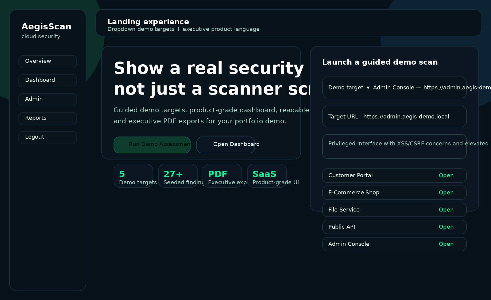
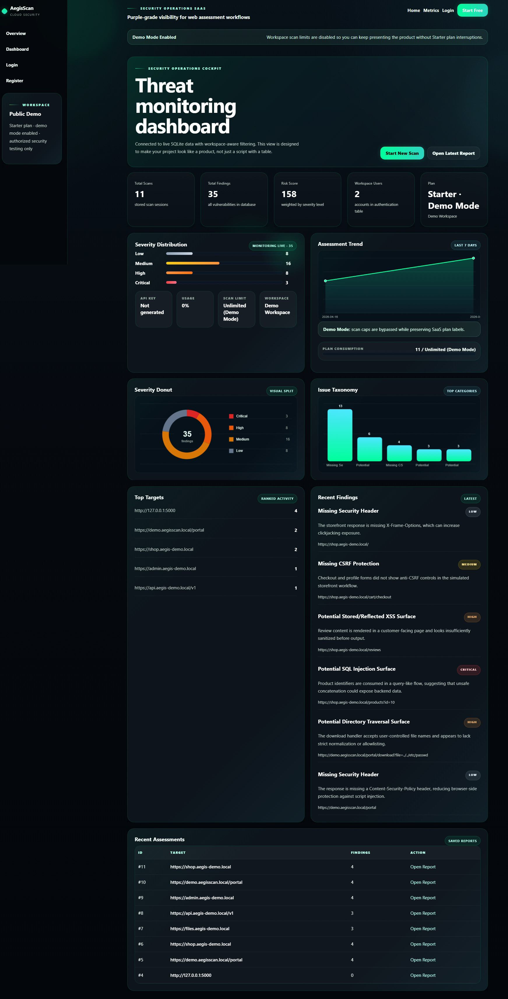
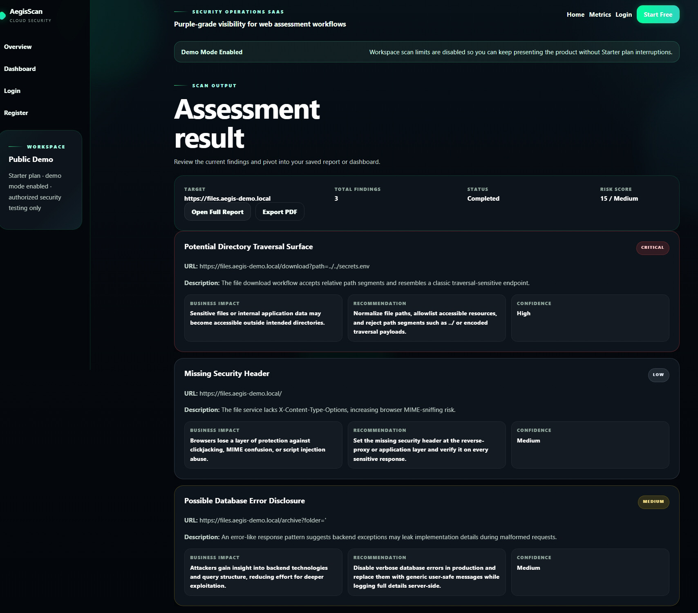
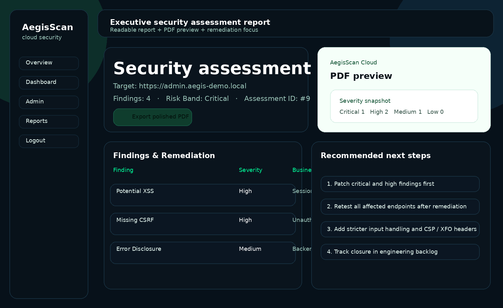

# 🛡️ AegisScan Cloud
> Product-grade Web Vulnerability Scanner with SaaS UI & Executive PDF Reporting

---

## 🚀 Overview

**AegisScan Cloud** is a full-stack cybersecurity platform that simulates real-world vulnerability scanning workflows and presents them through a modern SaaS-style interface.

---

## ✨ Key Highlights

- Guided Demo Scanning Experience  
- Realistic vulnerability simulation (XSS, SQLi, CSRF, Headers)  
- Threat Monitoring Dashboard  
- Executive PDF Reports  
- Demo Mode for portfolio showcasing  

---

## 🖥️ Screenshots

### 🏠 Landing Page


### 🚀 Demo Scan


### 📊 Dashboard


### 🔍 Assessment Result


### 📄 Report View


### 🔐 Login Page


### 📝 Register Page


---

## 📑 PDF Report

👉 See real generated report:  
[Download PDF](report_11.pdf)

---

## 🛠️ Tech Stack

- Backend: Flask (Python)
- Frontend: HTML, CSS
- Database: SQLite
- PDF: ReportLab
- DevOps: Docker

---

## ⚙️ Run Locally

```bash
docker compose up --build
```

Open:
http://127.0.0.1:5000

---

## 🧪 Demo Mode

```env
DEMO_MODE=true
```

---

## ⚠️ Disclaimer

For educational and authorized testing only.

---

## 👨‍💻 Author

Your Name
